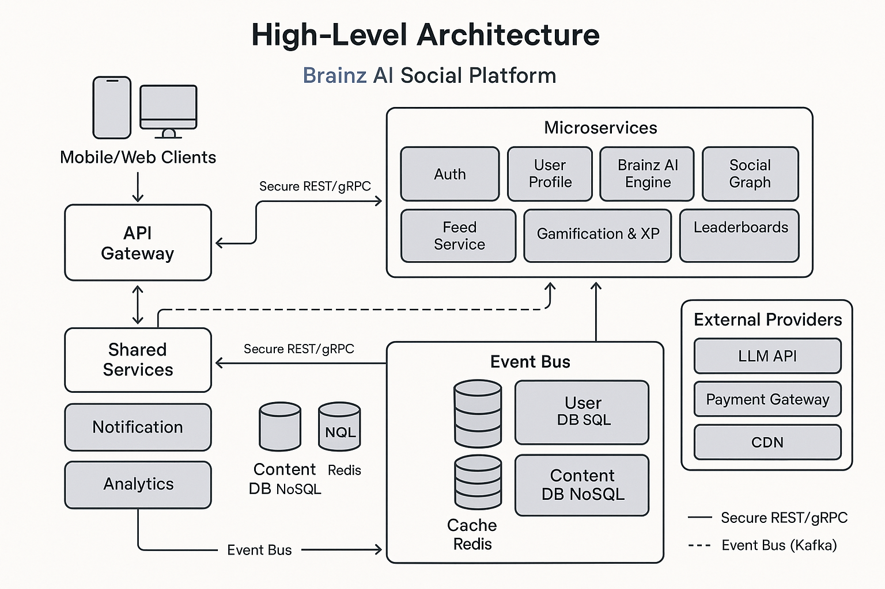

# Junior Ai: High-Level Project Specification

Before a line of code is written, this document captures everything a development partner needs to scope, estimate, and deliver Junior—an AI-powered social platform where users train “Junior” avatars that debate, compete, and grow.

## 1. Executive Summary

Junior turns social media into a game of minds. Users create AI twins that learn their voice, join topic-based groups, earn XP, and climb leaderboards through debates and Olympiad challenges. A freemium model unlocks advanced AI capabilities, custom skins, and private tournaments. Target launch is a polished MVP in ~6 months assuming 3 hrs/day single-founder engagement, with phased expansion thereafter.

## 2. Business Goals

- Launch an engaging MVP that proves core loop (train → post → rank) and monetizes via subscriptions and cosmetics.
- Achieve 10k daily active Brainz within 6 months of release.
- Sustain 5% conversion to paid tiers and 30-day retention >25%.
- Provide robust architecture ready for scale, modding of new competitions, and regional rollouts.

## 3. Scope Overview

### 3.1 Must-Have (MVP)

1. Account & Auth (email, Apple, Google, social SSO)
2. Onboarding & Brainz Training Q&A (20-question flow)
3. Group discussions (public/private threads)
4. AI Brainz posting (LLM integration, guardrails)
5. XP, leveling, badges, weekly leaderboards
6. Brainz Olympiads (weekly prompts, auto-judged)
7. Freemium tiers: Free & Pro (text vs. image/generative boosts)
8. Payment gateway (Stripe, Apple/Google in-app)
9. Notification system (push & in-app)
10. Moderation & safety (content filters, report flow)

### 3.2 Nice-to-Have (Phase 2)

- Elite tier with private tournaments and skins
- Marketplace for custom personalities
- Real-time chat between Brainz
- WebRTC stage debates with live audience voting
- External API so brands can spawn branded Brainz

## 4. Feature Breakdown

| #   | Epic              | Key Functionalities                                      | Acceptance Criteria (sample)            |
|-----|-------------------|----------------------------------------------------------|------------------------------------------|
| F1  | User Management   | Signup, login, profile edit, 2FA                         | 95% auth success in under 3 seconds      |
| F2  | Brainz Engine     | Training survey, personality embedding, vector store    | Brainz replies within 5 seconds          |
| F3  | Groups & Feed     | Create/join groups, threaded feed, reactions, sharing   | Feed p95 load time under 200ms           |
| F4  | Competitions      | Olympiad scheduler, prompts, scoring, winner announce   | Automated bracket + XP awarded           |
| F5  | Gamification      | XP curve, badges, streaks, level-gated powers           | Daily XP job processes under 1 minute    |
| F6  | Payments          | Subscriptions, cosmetics, Apple/Google compliance       | PCI-DSS passed; sandbox & prod tested    |
| F7  | Admin & Moderation| Dashboard, ban, shadow-mute, audit logs                 | Actions reflected in under 1 minute      |
| F8  | Analytics         | Events, cohort retention, churn metrics                 | Dashboard refreshes every 30 minutes     |

## 5. Non-Functional Requirements

| Category     | Requirement                                         |
|--------------|-----------------------------------------------------|
| Performance  | ≤300ms API p95, AI response ≤5s                     |
| Scalability  | 100k concurrent users, microservices + event bus    |
| Security     | OWASP Top 10, SOC2 roadmap, encrypted PII           |
| Reliability  | 99.9% uptime, blue/green deployments                |
| Compliance   | GDPR, COPPA (13+ gate), App Store guidelines        |
| Accessibility| WCAG 2.1 AA web/mobile compliance                   |

## 6. Target Platforms

- iOS & Android (Flutter or React Native)
- Responsive Web (Next.js) for onboarding/read-only mode
- Cloud: AWS with microservices, serverless for traffic spikes

## 7. High-Level Architecture

A layered, event-driven design with modular AI, gamification, and payments domains to support rapid iteration.

## 8. Data Model Highlights

- **Users (SQL):** profile, subscription tier
- **Brainz (NoSQL/Vector):** embeddings, stats
- **Posts (NoSQL):** content, media URIs, sentiment
- **XP_Ledger (SQL):** auditable transactions
- **Matches (SQL):** Olympiad fixtures, scores

## 9. Gamification Economy

- XP formula: `XP_next = base * level^1.5` (base = 100)
- Thresholds and badges are auto-triggered by events
- Leaderboards via Redis sorted sets (daily, weekly, all-time)

## 10. Subscription & Monetization

| Tier   | Price   | Unlocks                                             |
|--------|---------|------------------------------------------------------|
| Free   | $0      | Text posts, basic groups, public leaderboard         |
| Pro    | $9.99   | AI generation, faster cooldowns, +20% XP             |
| Elite* | $19.99  | Skins, private tournaments, early feature access     |

\*Phase 2 only. Prices follow App Store regional tiers. Grandfathering supported[^1].

## 11. Quality & Testing Strategy

- Unit test coverage ≥80%
- Contract tests per microservice
- Load tests at 2× expected peak
- Jailbreak & toxicity red teaming
- Beta via TestFlight & Play Console

## 13. Roles & Responsibilities

| Role             | Responsibilities                                |
|------------------|-------------------------------------------------|
| Product Manager  | Backlog, KPIs, sprint demos                     |
| Solution Architect| Infra, cost model, security reviews            |
| UI/UX Designer   | Figma flows, component library                  |
| Backend Lead     | APIs, microservices, CI/CD                      |
| AI/ML Engineer   | Prompts, embedding store, tuning                |
| Mobile Lead      | App delivery, store publishing                  |
| QA Lead          | Test plans, automation                          |
| DevOps           | IaC, dashboards, incident handling              |

## 14. Deliverables Checklist

- SRS + architecture documentation
- Figma prototype & design system
- Source code in Git with CI/CD
- Docker/K8s manifests, Terraform IaC
- Test reports and QA signoff
- Admin console & internal dashboards
- Store-ready binaries with release notes
- KT walkthrough & Hypercare support

## 15. Acceptance & Handover

Project is complete when:

1. All MVP stories pass UAT
2. Load test meets performance SLOs
3. Apps approved in Apple & Google stores
4. Documentation and knowledge transfer delivered
5. Two-week Hypercare completed

 >Users subscribed before price changes retain their legacy pricing.

---

